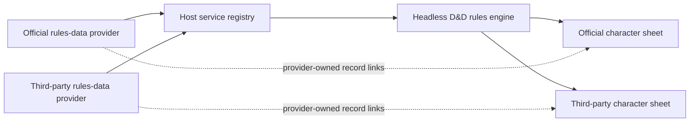
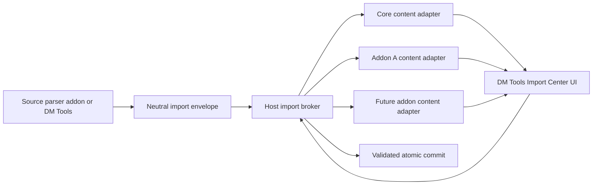

# Addon Boundary Audit

> Point-in-time architecture audit, 2026-08-04. This is not a backlog or
> roadmap; accepted work belongs in `docs/BACKLOG.md`.

## Scope

This audit covers the integration contracts, runtime code, tests, CI, and
developer documentation in these clean `main` worktrees:

| Repository | Revision | Role |
|---|---:|---|
| `ttrpg-codex` | `cbd732e` | Generic host |
| `dm-tools` | `212f3b4` | DM planning addon |
| `dnd-character-sheets` | `5cade56` | Character-sheet UI and D&D rules engine |
| `dnd55e-compendium` | `981bb88` | D&D 2024 content provider and browser |

Content records were sampled through their schemas and contract tests; the
audit did not manually review every compendium record. All four test suites
were run after inspection and passed:

- Host: 691 passed, 1 platform-dependent skip.
- DM Tools: 35 passed.
- D&D Character Sheets: 165 passed.
- D&D 2024 Compendium: 97 passed.

The green suites are important context: the principal problems below are
architectural contracts and missing integration cases, not unexplained current
test failures.

## Executive conclusion

The server-side addon foundation is mostly clean and generic. Installation,
permissions, namespaced storage, content directories, server routes,
transactions, lifecycle disposal, localization, and the graph facade do not
contain per-addon runtime allowlists. There are also no production imports
between sibling repositories.

The webpage is not yet addon-neutral in three important areas:

1. D&D Character Sheets recognizes exactly two content-provider addon IDs and
   constructs links to the current compendium's route.
2. The host Import Center contains DM Tools' planning document model, field
   semantics, styles, translations, collection-name heuristics, and an exact
   `dm-tools` API lookup. At the same time, there is no complete contract by
   which a future content addon can contribute its own validation, review,
   draft editing, commit planning, and view/edit links.
3. Several browser extension APIs are generic in signature but wired to only
   the existing core call sites. Competing implementations also expose gaps in
   fragment conflict fallback and global route/wiki namespaces.

The desired rule should be:

> The host changes only when a genuinely new host capability or extension
> surface is introduced. A new implementation of an existing versioned
> contract must install, bind, run, and uninstall without host source changes
> or edits to an existing consumer.

That goal is achievable, but it requires a generic service-binding layer. An
exact addon dependency and `host.use(addonId)` are correct when a consumer
needs one particular addon. They are the wrong abstraction when several
addons may implement the same contract.

## Recommended architecture decision

Adopt a host-level, domain-neutral service registry and keep the service
contracts themselves in public SDK/domain packages rather than in the host.

The host would understand only generic declarations and lifecycle:

- an addon provides one or more arbitrary service contract IDs and versions;
- a consumer requests a compatible contract with a cardinality such as zero,
  one, or many;
- the DM selects the binding when more than one provider is eligible;
- the resolved service edges participate in load order, reload, and disposal;
- consumers receive the selected provider through a scoped facade;
- contract-specific validation and conformance tests live with the public
  contract, not as D&D logic in core.

Keep `dependencies`, `optionalDependencies`, and `host.use(addonId)` for exact,
non-substitutable relationships. Adding more provider IDs to those lists would
only turn the present two-entry list into a growing whitelist.

### Import Center ownership decision

The user-facing Import Center belongs entirely to DM Tools. This means its
route, sidebar/dashboard entry, workflow state, source selection, review page,
combined summary, confirmation UI, CSS, and translations move out of the base
website. Disabling DM Tools must remove the Import Center from the UI without
leaving core fallback copy or an empty core route.

The host should retain only headless platform primitives that cannot safely be
owned by an ordinary addon: authentication and permissions, bounded import
jobs, revision checks, publication isolation, and atomic transactions across
core and addon-owned collections. These are not the Import Center product;
they are the neutral broker that prevents DM Tools from needing unrestricted
write access to every future addon.

| Import ownership option | Assessment |
|---|---|
| Entire product in core | Can centralize orchestration, but permanently puts DM workflow and addon-specific review policy in the base website; rejected. |
| Entire implementation including privileged writes in DM Tools | Looks physically separate, but requires DM Tools to know or bypass every target's schema and security boundary and cannot safely coordinate atomic core/addon writes; rejected. |
| Product in DM Tools, headless broker in host, adapters in content owners | Keeps every domain concern with its owner while preserving authorization and transaction safety; selected. |

“Completely inside DM Tools” therefore describes ownership of the visible
feature and its workflow policy. It does not move the host's generic security
and transaction boundary into an addon.

Responsibility must be explicit:

| Owner | Responsibilities |
|---|---|
| Host | Generic adapter registry, capability/version negotiation, scoped client/server facades, job and draft isolation, authorization, revision pinning, and atomic commit orchestration. No DM Tools schema, route, renderer, labels, or addon IDs. |
| DM Tools | The complete Import Center feature and orchestration UI. It enumerates adapters and composes their output but does not understand their payload schemas or write their collections directly. |
| Each content addon | Importable content-type declaration, payload/schema version, validation and normalization, change planning, review renderer, draft-edit controller, localization, and safe view/edit reference resolution for its own records. |
| Optional source addon | Parsing a particular external format into neutral target envelopes. A source parser must not take ownership of target-addon schemas. |

Client and server halves should share a stable owner-scoped identity such as
`(addonId, contributorId, contractVersion)`. A neutral envelope should identify
that target and carry an opaque versioned payload; DM Tools must never branch
on collection suffixes, addon IDs, or content kinds. The host routes the
payload only to its owning adapter.

Every importable content adapter should provide these capabilities:

1. **Describe:** localized name, content types, schema version, and availability.
2. **Validate and plan:** server-owned validation, normalization, reference
   checks, conflict detection, and proposed writes without publication.
3. **Review:** a scoped renderer/controller for summaries and detailed diffs.
4. **Modify the draft:** an inline editor or a safe addon-owned route that
   updates only the pending job, never live data before confirmation.
5. **Commit:** owner-produced transaction operations that the host validates
   and publishes atomically with the other contributors.
6. **Navigate:** host-validated view and edit references for previewed or
   committed records; plain labels remain the fallback when no route exists.

Adapters are discovered through the generic service/registration layer, not
through DM Tools dependencies. A content addon should not depend on DM Tools:
it registers its adapter with the host when the import capability is present,
and the contribution is simply dormant when no Import Center consumer is
installed. Conversely, DM Tools consumes zero or more compatible adapters and
contains no list of content-addon IDs.

Preview jobs must pin the adapter contract version, addon package/content
revision, and relevant collection revisions. Disabling or updating an adapter
invalidates its pending preview and fails closed instead of committing a plan
that was validated by different code.

### Alternatives considered

| Option | Result |
|---|---|
| Keep adding recognized addon IDs | Small initial change, but every new provider requires edits and releases in consumers; rejected. |
| Put D&D provider and ruleset knowledge in the host | Central discovery, but moves game-specific policy into the generic project; rejected. |
| Discover providers by addon-ID naming convention | Avoids a list but has no reliable contract/version, binding, or lifecycle semantics; rejected. |
| Generic service registry plus public domain contracts | Preserves a generic host, supports substitutes, and provides explicit compatibility and lifecycle; recommended. |

## Prioritized findings

Priority uses `(impact + regression risk) × (6 - effort)`, each input scored
from 1 to 5. The score favors safe, high-value early work; strategically
necessary larger changes can have a lower numeric score.

| ID | Severity | Repository boundary | Finding | I/R/E | Score |
|---|---|---|---|---:|---:|
| F1 | Critical | Sheets ↔ providers | Substitutable rules providers are an exact two-ID whitelist | 5/5/4 | 20 |
| F2 | Critical | Sheets ↔ providers | A partial foreign ruleset silently inherits D&D 2024 rules | 5/5/4 | 20 |
| F3 | Critical | Host ↔ DM Tools ↔ content addons | The Import Center is in core and content addons cannot own complete import adapters | 5/5/4 | 20 |
| F4 | High | Host fragments | Unresolved custom-sheet conflicts do not fully restore the built-in layout | 5/4/2 | 36 |
| F5 | High | Sheets architecture | The reusable rules engine cannot be installed without the official sheet UI | 4/4/5 | 8 |
| F6 | High | Sheets ↔ providers | Sheet links assume the provider owns `#/compendium` | 4/4/2 | 32 |
| F7 | High | Public contract | Provider schema and conformance authority are fragmented and partly private | 4/4/3 | 24 |
| F8 | High | Host UI registry | Global routes and wiki kinds are first-wins names, blocking parallel substitutes | 4/4/5 | 8 |
| F9 | High | Addon lifecycle | Addon routes lack mount/unmount hooks, encouraging private DOM and event coupling | 3/4/3 | 21 |
| F10 | High | CI boundaries | Official-addon CI duplicates stale test filenames and misses the real cross-repo drift guard | 4/5/1 | 45 |
| F11 | Medium | Host editor API | `registerEditorFields` is advertised generically but works only for characters | 3/3/3 | 18 |
| F12 | Medium | Host slot API | Slot registration is open-ended, but only core can publish usable outlets | 3/3/4 | 12 |
| F13 | Medium | DM Tools references | Cross-addon references accept arbitrary IDs but have no discovery or navigation contract | 2/2/3 | 12 |
| F14 | Low | Host widgets | Combobox and multiselect data sources are fixed to characters and locations | 2/2/2 | 16 |
| F15 | Low | Core copy/docs | A few host strings and reference sections name official addons directly | 1/2/1 | 15 |

## Detailed findings and solutions

### F1. The character sheet has a rules-provider whitelist

**Evidence**

- `dnd-character-sheets/addon.json` declares only
  `dnd55e-compendium` and the reserved `dnd5e-compendium` as optional
  dependencies.
- `dnd-character-sheets/model.js` defines `DATA_ADDONS` with those same two
  IDs and selects the first provider whose API has `apiVersion >= 1`.
- `host.use(id)` deliberately exposes only declared dependencies. Host load
  order and consumer reloads are also derived from those exact dependency
  edges.
- The provider-order test explicitly locks in probing the second reserved ID
  only after the first is unavailable.

**Impact**

A third-party 2014, 2024, translated, or homebrew provider cannot be used by
the sheet without changing and republishing the sheet addon. If both official
provider IDs are installed, order in source code selects the winner; there is
no campaign-level binding. The host also cannot reload the consumer for an
unknown provider because no dependency edge exists.

**Solution**

Add versioned service declarations and DM-selected bindings. For example, the
sheet could consume an arbitrary contract such as `dnd5e.rules-data` while
providers advertise compatible versions of it. Store the selected provider in
the generic addon registry, not in sheet source. An exact-one binding should be
visible in the Addon Manager, with standalone/manual mode as the sheet's
documented no-provider behavior.

### F2. The ruleset abstraction is “D&D 2024 plus overrides”

**Evidence**

- `dnd-character-sheets/rules/ruleset.js` contains the complete 2024
  `DEFAULT_RULESET`.
- `resolveRuleset(record)` recursively overlays any provider record on that
  default.
- `dnd-character-sheets/tests/rules.mjs` asserts that a partial record tagged
  as 2014 retains the 2024 spell-slot table and `weaponMastery: true` unless
  each value is explicitly overridden.
- Provider probing checks only the broad API version, not a rules-data
  contract version or required method/schema shape.
- `provider-state.js` records the edition and materialized baseline, but not
  the provider addon ID, ruleset ID/version, contract version, or content
  revision.

**Impact**

An incomplete 2014 or homebrew provider can silently acquire 2024 mechanics.
Two providers that use the same edition tag are indistinguishable to saved
provider state. Bare record IDs in builder decisions are then interpreted
against whichever provider is currently active.

**Solution**

- Define a versioned, public ruleset schema with required fields and explicit
  compatibility.
- Give every ruleset a stable `rulesetId`; persist provider identity, contract
  version, ruleset ID/version, and content revision in the sheet's provider
  state.
- Allow inheritance only when declared explicitly, such as
  `extends: "dnd-2024"`; do not apply the 2024 default to an unrelated edition.
- Refuse or quarantine an incomplete incompatible provider instead of
  silently mixing rules.
- Namespace persisted record references by provider/ruleset where a change of
  provider can alter their meaning.

### F3. Import Center ownership and content-adapter ownership are split incorrectly

**Evidence**

The server-side campaign-bundle contribution protocol is generic. The client
is not:

- `web/js/import-center.js` parses the `dm-tools-planning` format, models
  stories, quests, branches, gates, outcomes, and consequences, fabricates the
  `dm-tools:planning_items` collection identity, and calls
  `Addons.providedApi('dm-tools')?.campaignImportReview`.
- The same module treats every collection whose name ends in
  `:planning_items` as DM Tools planning data and removes it from the generic
  change list.
- `web/js/import-review.js` maps planning fields to DM Tools document
  semantics and locates data using the exact addon ID, contributor ID, and
  format.
- `web/css/import-center.css` contains the story-canvas, quest, branch, flow,
  and consequence review presentation.
- Core English and Czech catalogs contain the corresponding DM planning
  labels.
- DM Tools already owns the actual preview renderer in
  `dm-tools/import-review-preview.js` and exposes it from `entry.js`; the host
  reaches it through the exact ID.
- There is no paired client/server contract requiring each future content
  addon to own its import schema, validation, review, draft editing, commit
  planning, and view/edit references. The existing generic server contributor
  identity covers only part of that lifecycle.

**Impact**

Changing DM Tools' import schema requires coordinated core releases. A
different addon using the innocent collection name `planning_items` is
misclassified and hidden from generic review. Another bundle contributor
cannot supply an equally rich review or draft editor without a new host or DM
Tools special case. Giving DM Tools direct access to every addon collection
would merely reverse the dependency and create a privileged schema whitelist
inside DM Tools.

**Solution**

Move the entire user-facing Import Center to DM Tools. Remove its route,
workflow controller, review composition, import-specific CSS, and translations
from the host. Keep only the host's headless authorization, job, revision, and
atomic-transaction broker.

Extend the existing server contributor identity `(addonId, contributorId)`
into a versioned paired adapter contract. The target content addon must own its
server validation/plan/commit half and its client review/edit/navigation half.
DM Tools discovers all compatible adapters, composes their controllers inside
its page, and treats their versioned payloads as opaque. Core content should be
represented by a host-owned core adapter using the same contract rather than a
special code path in DM Tools. Remove the exact `dm-tools` lookup and every
collection-suffix heuristic.

### F4. Fragment conflict fallback leaves the article in takeover layout

**Evidence**

- `web/js/addon-fragments.js` correctly retains the built-in fragment when two
  exclusive claims are unresolved or when the DM explicitly chooses the
  built-in implementation.
- `web/js/addons.js` method `bodyOverridden(kind)` returns true when any
  exclusive body claim exists, without considering conflict resolution.
- `web/js/wiki.js` uses that boolean before applying fragment operations to
  fold the normal side content and choose the full-width article layout.
- Pure fragment tests cover built-in fallback, but no article-shell integration
  test verifies the resulting layout.

**Impact**

Installing two custom character sheets can put the supposedly safe built-in
fallback into a half-taken-over layout. Choosing “built-in” in conflict
resolution does not fully restore the built-in page.

**Solution**

Expose the resolved exclusive owner for a target, including “none/built-in,”
and decide the article layout from that result. Only a real active `replace` or
`hide` winner should enable takeover layout. Add integration tests for no
claim, one winner, unresolved claims, explicit built-in, and a removed stale
winner.

### F5. The rules engine is inseparable from the official sheet UI

**Evidence**

`dnd-character-sheets/entry.js` both registers the exclusive
`characters:body` replacement and provides the rules API during the same
registration. The host stores one provided API per addon ID.

**Impact**

A custom sheet cannot reuse the tested rules engine without installing the
official sheet takeover, its actions, and its UI. It immediately creates a
fragment conflict with the custom sheet. Conversely, a new engine
implementation is entangled with a particular UI package.

**Solution**

Extract `rules/` and the public rules contract into a headless
`dnd5e-rules-engine` addon/package that provides a versioned service and claims
no UI fragment. Both the official and third-party sheets can consume it. An
API-only mode in the existing addon could be a transition, but a separate
package gives cleaner ownership, independent releases, and clearer tests.

### F6. Sheet record links are tied to one compendium route

**Evidence**

`dnd-character-sheets/helpers.js` builds every provider record link as
`#/compendium/${kind}:${id}`. `dnd55e-compendium/entry.js` happens to register
that route. Its provided content API has no record-link resolver.

**Impact**

A compatible headless provider or a provider with its own namespaced browser
can supply correct data while every sheet link points to the wrong addon.

**Solution**

Make navigation part of the provider contract: either expose
`recordHref(kind, id)`/reference metadata or use a generic host record-reference
resolver. The sheet must treat links as provider-owned optional capabilities
and render plain labels when no browser is available.

### F7. The provider contract has no neutral public authority

**Evidence**

- The compendium's `data/SCHEMA.md` describes itself as the canonical provider
  contract, but the repository is private.
- Sheet documentation points developers to that sibling schema while the
  executable assumptions are split among the sheet engine, fake provider,
  rules tests, and compendium implementation.
- The 2024 default exists both in the sheet engine and in the compendium's
  ruleset record.
- The drift test in `dnd-character-sheets/tests/rules.mjs` reads the sibling
  compendium only if present and otherwise skips. The current GitHub workflows
  check out the repositories separately, so the important cross-repository
  drift guard is absent in ordinary CI.

**Impact**

A third-party provider author cannot implement a stable public contract from
one authoritative source. Compatible changes can drift while every repository
remains green independently.

**Solution**

Publish a small provider SDK/conformance kit alongside the headless engine:
versioned JSON schemas, TypeScript/JSDoc shapes if useful to authors, canonical
fixtures, and consumer/provider contract vectors. Make one artifact the source
of truth for the 2024 default rather than maintaining two copies. Each provider
should run the same conformance suite without needing a sibling checkout.

### F8. Global route and wiki names block parallel implementations

**Evidence**

`registerRoute`, `registerPageRenderer`, and `registerWikiKind` in
`web/js/addons.js` reject a name already owned by another addon. Registration
failure rolls back the addon. The compendium therefore owns global names such
as `/compendium`, `/bestiary`, and D&D wiki kinds. Its README explicitly
documents a current one-addon-per-game-system constraint.

**Impact**

Two substitute compendiums that reuse familiar routes or wiki scopes cannot be
installed together for selection. A supplement addon cannot contribute a
parallel implementation without being merged into the base provider. Avoiding
the route collision does not solve F6 because the sheet assumes the global
route anyway.

**Solution**

- Give every addon automatic namespaced routes such as
  `#/addons/<addon-id>/...`.
- Treat short global routes as optional aliases with explicit conflict
  resolution, not as an addon's only address.
- Resolve wiki kinds by provider/service identity; unqualified aliases can
  follow the campaign's selected provider.
- Keep “one selected base rules-data provider” initially. If independent
  supplements are a real product requirement later, add a many-provider
  aggregation contract with explicit provenance and collision rules rather
  than silently merging records.

### F9. Addon route lifecycle is underspecified

**Evidence**

`registerRoute` returns HTML but provides no route mount, unmount, or leave
hooks. DM Tools schedules work after rendering, queries a page by its own
`data-addon-id`, listens directly to `window.hashchange`, and consumes an
undocumented `role:changed` custom event.

**Impact**

Complex addon pages depend on DOM timing and private host events. Cleanup and
role transitions are easy to miss, and future custom pages will copy the same
pattern.

**Solution**

Allow a route controller with `render`, `mount`, and `unmount`, or add scoped
route-enter/leave lifecycle subscriptions. Document a scoped role-change
subscription if addons need one. The host should call lifecycle hooks during
navigation and disposal so addons do not inspect global route state.

### F10. Official-addon CI is duplicated and stale

**Evidence**

- The host's `.github/workflows/addon-compatibility.yml` checks out exact
  official repositories and lists exact test filenames.
- DM Tools' own workflow and the host compatibility workflow refer to
  `tests/provider.mjs` and `tests/scenario-graph.mjs`.
- Those files do not exist; the current files are
  `tests/planning-provider.mjs` and `tests/story-planner.mjs`.
- Other addon workflows also maintain partial hand-written test lists and use
  sibling paths to reach the host authoring harness.

**Impact**

The compatibility matrix can fail before testing useful behavior, omit newly
added files, and still not exercise the actual sheet/compendium contract drift
described in F7. This is not a runtime whitelist, but it is duplicated support
work in the host repository.

**Solution**

Immediately replace stale paths and make each addon own a single full test
command. Then publish/version the authoring and domain conformance harnesses or
provide reusable workflows. The host may keep a curated official-addon matrix
as release assurance, but it should invoke repository-owned commands rather
than duplicate their inventories.

### F11. Generic editor fields are character-only in practice

**Evidence**

The public `registerEditorFields(kind, ...)` API accepts an arbitrary kind, but
`web/js/edit_templates.js` emits an addon field slot only for characters and
`web/js/editmode.js` collects/mounts those fields only in the character save
path. The authoring documentation acknowledges that current wiring.

**Impact**

An addon that wants to extend a location, event, artifact, or another core
editor needs a host change despite conforming to the apparent API.

**Solution**

Move rendering, mounting, validation, and collection into a common core editor
adapter used by every supported kind, with entity/context passed uniformly. If
that generalization is not intended, rename/narrow the API now so authors do
not mistake it for an open extension surface.

### F12. Addons can fill slots but cannot publish their own outlets

**Evidence**

Addon code may register an open-ended slot ID, but only core modules call the
private `Addons.slotContent(...)` renderer. The live call sites are a fixed set
of dashboard, DM dashboard, map-pin, and timeline surfaces. `host.ui` exposes
toast, rerender, and announce, not a scoped outlet renderer.

**Impact**

The documented open-ended namespace is misleading, and an addon page cannot
become a host for optional extensions without new core code or a private
coupling.

**Solution**

Expose a safe scoped outlet API for addon-owned pages, such as
`host.ui.renderSlot(localId, context)`, with ownership and dependency or
permission checks. Keep the existing core outlets as stable predefined slots.

### F13. DM Tools external references are generic but manual-only

**Evidence**

`dm-tools/planning-contract.js` correctly accepts arbitrary external
`addonId`, `kind`, `id`, and fallback `label`; it has no sibling whitelist and
does not delete a reference just because its provider is absent. The planner
UI, however, can only accept these as manual values and cannot discover
records, verify availability, or ask the owner for a route.

**Impact**

The storage boundary is healthy, but richer integrations require custom code
for each provider and can lead users to stale or unresolvable identifiers.

**Solution**

Add an optional generic record-catalog/reference service that can search,
label, report availability, and resolve view/edit navigation for namespaced
references. The Import Center adapter contract should use the same reference
shape rather than inventing separate links. Preserve the current manual
fallback and stored label so documents remain readable without the referenced
addon.

### F14. Host widgets expose fixed domain sources

**Evidence**

`web/js/widgets/widgets.js` recognizes character and location as data sources.
The public authoring guide notes that combobox/multiselect sources are not
arbitrary addon option providers.

**Impact**

This is a smaller ergonomics issue: addons can render a plain select, but they
cannot reuse the host widget with their own catalog without core work.

**Solution**

Allow an explicit options array/provider callback through a safe host UI
constructor. Do not make the Store aware of addon-specific source names.

### F15. Minor suite-specific copy and documentation remain in core

**Evidence**

The core DM fallback message names DM Tools directly. Several host reference
sections describe exact companion IDs and reserved providers in detail.

**Impact**

This does not create runtime coupling, but it makes the generic host appear to
endorse a required addon and causes core documentation churn when companion
behavior changes.

**Solution**

Use generic copy such as “workflow addons” in the host. Keep a short companion
ecosystem overview, but make addon repositories and the public domain contract
the authority for their behavior.

## Code that is correctly placed

The following exact lists or identities should not be removed merely because
they resemble whitelists:

- `KNOWN_CAPABILITIES` is the host's versioned feature-negotiation surface.
  Adding a genuinely new host capability must be a deliberate host change.
- `HOST_SERVER_LIBS` is a security and supply-chain allowlist for code loaded
  inside the host process. It should remain narrow.
- Built-in route reservations protect core navigation. The problem is the lack
  of namespaced addon routes and alias arbitration, not the reservation itself.
- Permission syntax, scoped facades, and grants are generic; they do not list
  the official addons.
- Core's `ACTIONS` map is not an addon whitelist. Addon actions use the scoped
  action dispatcher and do not need to be imported into `app.js`.
- An addon's own stable ID in its manifest, data namespace, selectors, or
  server URL is generally legitimate. Deriving its own content URL and DOM
  scope from `host.id` would make forks easier, but this is an ergonomics
  improvement rather than cross-repository bleed.
- DM Tools production code contains no D&D sheet or compendium IDs, and the
  compendium production code contains no sibling addon IDs.
- The host's server-side bundle provider/contributor protocol, namespaced
  collection storage, `contentDir`, transactions, localization, graph facade,
  dependency lifecycle, and permission checks are good foundations to retain.
  In particular, import authorization, job isolation, revision checks, and
  atomic publication remain host responsibilities even after the entire
  user-facing Import Center moves to DM Tools.

## Remediation sequence

### Phase 0 — correctness and false confidence

1. Fix fragment takeover layout to use resolved ownership and add the missing
   article-shell integration tests.
2. Repair stale DM Tools workflow filenames and replace duplicated file lists
   with repository-owned test commands.
3. Ensure the provider drift/conformance check really runs in CI.
4. Change the DM dashboard fallback copy to generic wording.

These are low-effort changes that reduce current risk without committing to a
large service design.

### Phase 1 — define substitutable services

1. Write an ADR for generic `provides`/`consumes` declarations, compatibility,
   cardinality, binding persistence, permissions, and lifecycle ordering.
2. Implement the registry and Addon Manager binding UI without any D&D service
   IDs in host source.
3. Define the paired import-target adapter contract and a separate optional
   source-parser contract. Both must be owner-scoped, versioned, and usable
   without exact addon dependencies.
4. Add provider-owned record references with host-validated view/edit
   navigation and plain-label fallback.
5. Add scoped mount/unmount lifecycle for addon routes and embedded adapter
   controllers so DM Tools does not coordinate them through DOM timing or
   private global events.
6. Extend the published authoring harness so a content addon can prove its
   client and server adapter halves agree and clean up correctly.

### Phase 2 — move the complete Import Center into DM Tools

1. Implement a host-owned core-content adapter using exactly the same target
   contract required of addon content; do not hard-code core fields in DM Tools.
2. Move the route, navigation entry, workflow state, source selection, combined
   review page, confirmation UI, CSS, and catalogs from core into DM Tools.
3. Move DM Tools' planning adapter fully into its own package and register it
   through the generic target contract.
4. Make DM Tools enumerate zero or more target adapters and source parsers. It
   must handle their envelopes opaquely and compose their review/edit
   controllers through scoped lifecycle hooks.
5. Remove `web/js/import-center.js`, `web/js/import-review.js`, core
   import-center CSS/catalog entries, the exact `dm-tools` API lookup, and every
   `:planning_items` heuristic once no other core consumer remains.
6. Prove independence with a fixture addon whose unknown content type supplies
   validation, review, draft editing, commit planning, and view/edit links;
   neither host nor DM Tools source may mention its ID or kind.

### Phase 3 — separate D&D layers

1. Publish the rules-data contract and conformance kit.
2. Extract the headless rules engine and public contract from the sheet UI.
3. Persist complete provider/ruleset identity and make ruleset inheritance
   explicit.
4. Make the official sheet consume the engine and selected rules-data services.
5. Migrate the two reserved provider IDs through a temporary compatibility
   adapter, then remove the sheet's `DATA_ADDONS` list.
6. Prove the design with a small fake third-party provider and a second minimal
   sheet, neither mentioned by host or existing-addon source.

### Phase 4 — finish the advertised browser extension surfaces

1. Generalize editor fields across supported core kinds.
2. Let addon pages publish scoped slot outlets.
3. Add data-driven widget option providers.
4. Add namespaced routes and provider-aware wiki aliases; evaluate supplement
   aggregation separately from base-provider substitution.

## Acceptance criteria

The boundary is complete when all of the following can be demonstrated:

- A newly named rules-data addon, absent from all existing source code, appears
  as a compatible provider, can be selected, drives sheet calculations, and is
  reloaded/disposed in the right order.
- With two compatible providers installed, the campaign binding—not source
  order—selects one; switching is explicit and saved sheet state records the
  transition safely.
- A provider without a browser produces plain labels, and a provider with a
  browser opens its own route through its API rather than a hard-coded path.
- A custom sheet can consume the shared rules engine without installing the
  official sheet UI.
- Two sheet takeovers leave the fully native article intact until the DM picks
  a winner; selecting built-in also restores the native layout.
- Disabling DM Tools removes the complete Import Center route and UI; the host
  retains only headless import APIs and contains no Import Center product copy,
  CSS, DM planning model, or empty fallback page.
- A previously unknown content addon registers a paired import adapter and
  automatically appears in DM Tools with its own validation, review, draft
  modification, commit plan, localization, and post-commit view/edit links.
  Neither host nor DM Tools source mentions its addon ID, collection, or kind.
- A collection named `planning_items` is not special. DM Tools branches only
  on versioned adapter capabilities, never on addon IDs or naming conventions.
- Removing or updating a target adapter invalidates its pending preview; no
  plan can commit against different adapter code or collection revisions.
- Core records participate through a core-owned adapter that implements the
  same public contract as addon records.
- An addon can extend every editor kind promised by the API and can publish a
  scoped outlet on its own page.
- Provider and consumer conformance runs without sibling checkouts, and a
  deliberately incompatible contract version fails closed.
- A guard test finds no official addon IDs in host runtime code, except a
  narrowly documented temporary migration adapter.
